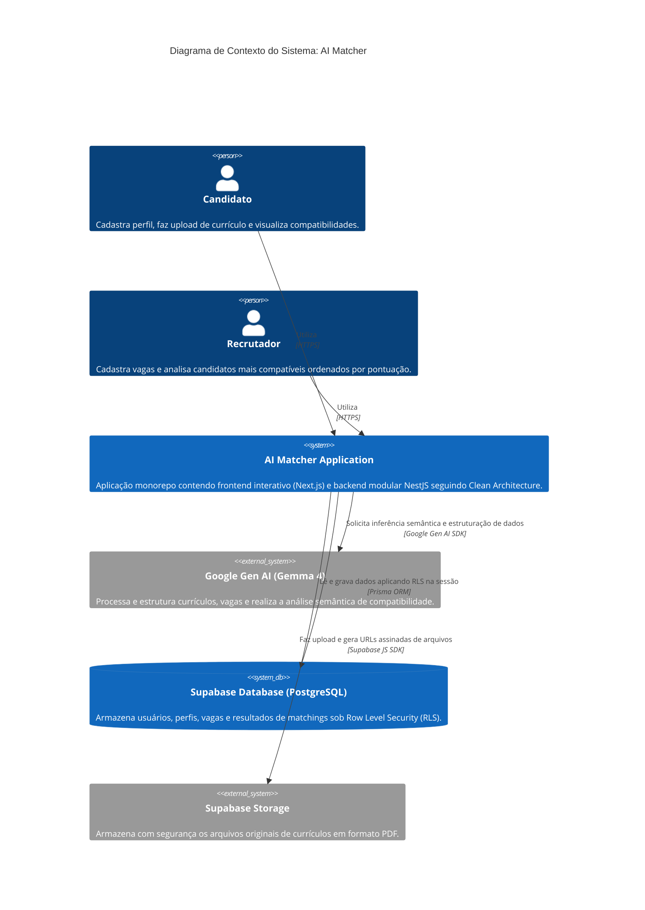

# AI Matcher - System Context & Architecture

Este documento descreve o contexto do sistema, arquitetura, modelo C4, entidades, endpoints e o fluxo geral da plataforma **AI Matcher**.

---

## 1. Visão Geral do Sistema

### Descrição Curta
O **AI Matcher** é uma plataforma inteligente que automatiza o matching de currículos de candidatos com vagas de tecnologia utilizando inteligência artificial generativa avançada (Gemma 4).

### Descrição Longa
O sistema resolve o gargalo de recrutamento em tecnologia extraindo automaticamente o texto de currículos em formato PDF, estruturando os dados profissionais de forma rica (experiências, habilidades, idiomas) via Inteligência Artificial e executando um matching semântico profundo contra vagas cadastradas. Ao invés de buscar palavras-chave simples, a IA analisa a compatibilidade real da senioridade, tecnologias e pretensões, atribuindo uma nota de compatibilidade detalhada (score) acompanhada de uma justificativa de pontos fortes, pontos fracos e recomendações.

---

## 2. Personas (Usuários)

### Candidato (Profissional)
*   **Tipo**: Usuário Humano
*   **Descrição**: Profissional de tecnologia buscando oportunidades de trabalho.
*   **Objetivos**: Cadastrar seu perfil, fazer upload do seu currículo em PDF e visualizar as vagas compatíveis com suas competências e pretensões.
*   **Funcionalidades Principais**: Registro/Login, Upload de Currículo, Edição de Preferências, Visualização de Vagas e Matchings correspondentes.

### Recrutador (RH / Tech Recruiter)
*   **Tipo**: Usuário Humano
*   **Descrição**: Responsável pela aquisição de talentos ou contratação técnica em empresas.
*   **Objetivos**: Criar vagas estruturadas e identificar os candidatos mais qualificados ordenados por pontuação de compatibilidade.
*   **Funcionalidades Principais**: Registro/Login, Criação e Edição de Vagas, Visualização de Matchings e Perfis de Candidatos para uma vaga específica.

---

## 3. Funcionalidades do Sistema

### Autenticação e Gestão de Sessão
*   Autenticação customizada utilizando e-mail/senha com hashing seguro via `bcrypt`.
*   Geração de Tokens JWT no NestJS para autenticação stateless.
*   Passagem de credenciais seguras para o banco de dados via variáveis locais para garantir proteção de dados multi-tenant.

### Processamento Inteligente de Currículo (IA)
*   Extração do conteúdo de arquivos PDF.
*   Uso do **Gemma 4** (Google Gen AI) para estruturar os dados não estruturados do currículo em entidades formais de banco de dados (experiência, formação acadêmica, competências).
*   Upload seguro do arquivo original em PDF para o Supabase Storage Bucket com geração de links assinados temporários.

### Estruturação de Vagas (IA)
*   Análise de descrições brutas de vagas.
*   Estruturação automática dos requisitos mínimos, desejáveis e diferenciais da vaga via inteligência artificial.

### Matching Avançado
*   Matching semântico executado pela IA analisando o currículo estruturado em comparação com os requisitos da vaga.
*   Retorno rico contendo score de 0 a 100, justificativa, pontos fortes, pontos fracos e recomendações de desenvolvimento.

---

## 4. Diagrama de Contexto de Sistema (C4 Model)



---

## 5. Arquitetura de Software (Clean Architecture)

O backend do projeto é escrito em **NestJS/TypeScript** seguindo os princípios de **Clean Architecture** para manter o núcleo da aplicação (domínio e regras de negócio) isolado de frameworks, bibliotecas e tecnologias externas.

```
/backend
  ├── prisma/                      # Schema relacional e migrações do banco de dados
  └── src/
      ├── domain/                  # Núcleo do Sistema (Sem dependências externas)
      │   ├── entities/            # Entidades de Negócio (Usuario, Vaga, Matching)
      │   ├── repositories/        # Contratos/Interfaces de Acesso a Dados
      │   ├── services/            # Contratos/Interfaces de Serviços (IA, PDF, Cripto)
      │   └── use-cases/           # Casos de Uso (Lógica principal de negócio)
      │
      ├── infrastructure/          # Detalhes de Implementação Tecnológica
      │   ├── ai/                  # Integração com Google Gen AI SDK (Gemma 4)
      │   ├── database/            # Conexão Prisma e Repositórios concretos com RLS
      │   ├── pdf/                 # Extração de PDF usando pdf-parse
      │   ├── security/            # Criptografia com bcrypt e Tokens com jsonwebtoken
      │   └── storage/             # Integração com Supabase Storage
      │
      ├── presentation/            # Camada de Comunicação Externa (HTTP)
      │   ├── controllers/         # Controllers REST
      │   ├── dtos/                # Data Transfer Objects (Validação de Entrada)
      │   ├── guards/              # Autenticação de rotas (JWT Auth Guard)
      │   ├── middlewares/         # Middleware de contexto RLS
      │   └── nest-modules/        # Módulos do NestJS que injetam as dependências
      │
      ├── app.module.ts            # Módulo Raiz da Aplicação
      └── main.ts                  # Ponto de entrada (Inicialização e CORS)
```

---

## 6. Entidades de Domínio

As entidades de negócio estão contidas em `src/domain/entities`:

1.  **Usuario**: Classe raiz que representa a conta e centraliza os relacionamentos. Armazena dados cadastrais, preferências de trabalho e os dados estruturados do currículo gerados pela IA.
2.  **Perfil**: Detalhes profissionais resumidos do usuário (pretensão salarial, anos de experiência, disponibilidade).
3.  **Experiencia**: Histórico profissional do candidato (empresa, cargo, datas e tecnologias utilizadas).
4.  **Formacao**: Histórico educacional e acadêmico do candidato.
5.  **Habilidade**: Competências e habilidades técnicas mapeadas.
6.  **Certificacao**: Certificados profissionais obtidos.
7.  **Idioma**: Línguas dominadas e nível de proficiência.
8.  **Preferencia**: Filtros e preferências de trabalho (modalidade, cidades desejadas, tipos de contrato).
9.  **Vaga**: Representa uma vaga aberta por um recrutador. Armazena o perfil da vaga, empresa, modalidade, faixas salariais, requisitos técnicos gerados por IA e palavras-chave.
10. **Matching**: Representa o resultado final da compatibilidade de um candidato com uma vaga, contendo o score numérico de 0 a 100 e a análise de compatibilidade detalhada em formato JSON.

---

## 7. Mecanismo Row Level Security (RLS)

Diferente de abordagens tradicionais onde o backend opera com total liberdade, o AI Matcher utiliza **Row Level Security (RLS)** nativo no PostgreSQL do Supabase para garantir isolamento absoluto de dados.

### Como funciona:
1.  O cliente faz uma requisição HTTP enviando seu token JWT customizado.
2.  O **`RlsMiddleware`** intercepta a requisição, valida o token, extrai o ID do usuário (`userId`) e o define em um fluxo de contexto isolado por thread utilizando o **`AsyncLocalStorage`** do Node.js.
3.  Toda query executada pelos repositórios do Prisma é envelopada em `this.prisma.runWithRLS()`.
4.  Esta função executa a query dentro de uma transação PostgreSQL iniciando com a instrução:
    ```sql
    SELECT set_config('request.jwt.claims', '{"sub": "USER_ID", "role": "authenticated"}', true);
    ```
5.  O Postgres lê o ID contido em `request.jwt.claims` e a função nativa **`auth.uid()`** do Supabase é alimentada. As tabelas bloqueadas por RLS no Supabase filtram os resultados automaticamente, garantindo que usuários comuns só tenham acesso a dados que lhes pertencem (`id = auth.uid()` ou `usuario_id = auth.uid()`).

---

## 8. Endpoints HTTP da API

### Autenticação & Usuário (`/usuarios`)
*   `POST /usuarios/registrar`: Cadastra um novo usuário no sistema.
*   `POST /usuarios/login`: Autentica o usuário e retorna o token JWT.
*   `GET /usuarios/me`: Retorna os dados do perfil logado (requer token).

### Currículos (`/curriculos`)
*   `POST /curriculos/processar`: Endpoint multipart que recebe um arquivo em PDF, faz o upload privado no Supabase Storage, extrai o texto do PDF, roda a estruturação do perfil via Gemma 4 e salva os dados na ficha do candidato logado (requer token).

### Vagas (`/vagas`)
*   `POST /vagas`: Cria e analisa semântica de uma nova vaga de trabalho (requer token).
*   `GET /vagas/:id`: Retorna os detalhes de uma vaga específica.
*   `GET /vagas`: Lista as vagas ativas disponíveis.

### Matchings (`/matchings`)
*   `POST /matchings/executar`: Dispara a análise de compatibilidade semântica profunda de IA entre o candidato logado e uma vaga específica, retornando e salvando o matching (requer token).
*   `GET /matchings/candidato`: Lista os matchings obtidos pelo candidato logado (requer token).
*   `GET /matchings/vaga/:vagaId`: Retorna os candidatos ordenados por maior score de matching para uma vaga específica (requer perfil de recrutador / token).
