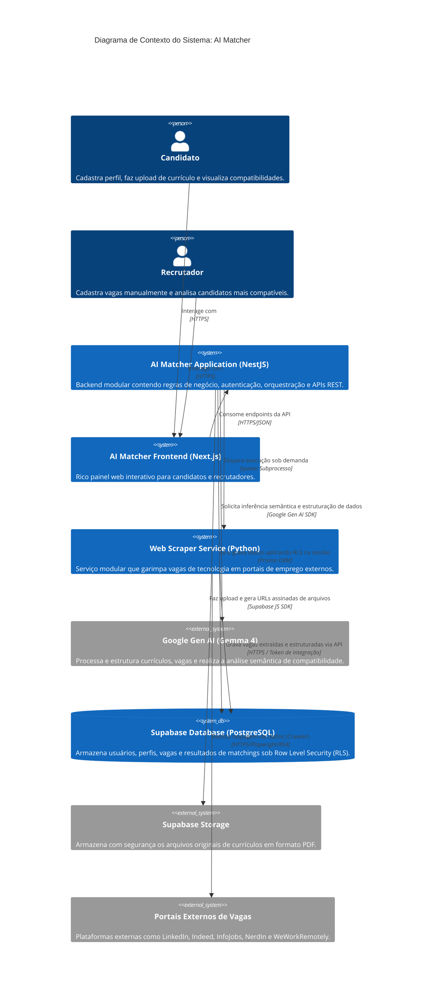

# AI Matcher - System Context & Architecture

Este documento descreve o contexto do sistema, arquitetura, modelo C4, entidades, endpoints e o fluxo geral da plataforma **AI Matcher**.

---

## 1. Visão Geral do Sistema

### Descrição Curta
O **AI Matcher** é uma plataforma inteligente que automatiza o matching de currículos de candidatos com vagas de tecnologia utilizando inteligência artificial generativa avançada (Gemma 4).

### Descrição Longa
O sistema resolve o gargalo de recrutamento em tecnologia extraindo automaticamente o texto de currículos em formato PDF, estruturando os dados profissionais de forma rica (experiências, habilidades, idiomas, projetos) via Inteligência Artificial e executando um matching semântico profundo contra vagas cadastradas.

Além disso, a plataforma conta com um serviço autônomo de garimpo de vagas (Web Scraper) em Python que minera vagas de tecnologia de múltiplos portais (LinkedIn, NerdIn, Indeed, InfoJobs, WeWorkRemotely) e as integra diretamente ao banco de dados.

Ao invés de buscar palavras-chave simples, a IA analisa a compatibilidade real da senioridade, tecnologias e pretensões, atribuindo uma nota de compatibilidade detalhada (score) acompanhada de uma justificativa de pontos fortes, pontos fracos e recomendações de desenvolvimento.

---

## 2. Personas (Usuários)

### Candidato (Profissional)
*   **Tipo**: Usuário Humano
*   **Descrição**: Profissional de tecnologia buscando oportunidades de trabalho.
*   **Objetivos**: Cadastrar seu perfil, fazer upload do seu currículo em PDF e visualizar as vagas compatíveis com suas competências e pretensões.
*   **Funcionalidades Principais**: Registro/Login, Upload de Currículo, Edição de Preferências e Projetos, Visualização de Vagas e Matchings correspondentes.

### Recrutador (RH / Tech Recruiter)
*   **Tipo**: Usuário Humano
*   **Descrição**: Responsável pela aquisição de talentos ou contratação técnica em empresas.
*   **Objetivos**: Criar vagas estruturadas e identificar os candidatos mais qualificados ordenados por pontuação de compatibilidade.
*   **Funcionalidades Principais**: Registro/Login, Criação e Edição de Vagas, Visualização de Matchings e Perfis de Candidatos para uma vaga específica.

---

## 3. Funcionalidades do Sistema

### Autenticação e Gestão de Sessão
*   Autenticação customizada utilizando e-mail/senha com hashing seguro via `bcrypt`.
*   Geração de Tokens JWT no NestJS para autenticação stateless.
*   Passagem de credenciais seguras para o banco de dados via variáveis locais para garantir proteção de dados multi-tenant.

### Processamento Inteligente de Currículo (IA)
*   Extração do conteúdo de arquivos PDF.
*   Uso do **Gemma 4** (Google Gen AI) para estruturar os dados não estruturados do currículo em entidades formais de banco de dados (experiência, formação acadêmica, competências, projetos).
*   Upload seguro do arquivo original em PDF para o Supabase Storage Bucket com geração de links assinados temporários.

### Estruturação de Vagas (IA)
*   Análise de descrições brutas de vagas.
*   Estruturação automática dos requisitos mínimos, desejáveis e diferenciais da vaga via inteligência artificial.

### Garimpo e Agregação de Vagas (Scraping)
*   Serviço autônomo escrito em Python que extrai vagas de tecnologia em tempo real.
*   Suporte a múltiplos portais externos: LinkedIn, Indeed, InfoJobs, NerdIn e WeWorkRemotely.
*   Agendamento integrado (Cron Job) no NestJS para execução diária automática à meia-noite.
*   Endpoint REST seguro para acionamento sob demanda do orquestrador do scraper.

### Matching Avançado
*   Matching semântico executado pela IA analisando o currículo estruturado em comparação com os requisitos da vaga.
*   Retorno rico contendo score de 0 a 100, justificativa, pontos fortes, pontos fracos e recomendações de desenvolvimento.

---

## 4. Diagrama de Contexto de Sistema (C4 Model)



---

## 5. Estrutura do Projeto (Monorepo)

O projeto é organizado como um monorepo contendo o frontend web, o servidor backend modular de API, o serviço de raspagem de dados e as configurações de banco.

```
/aimatcher
  ├── /backend                      # Servidor de API (NestJS/TypeScript)
  │     ├── prisma/                 # Schema relacional e migrações do banco (Prisma)
  │     └── src/
  │         ├── domain/             # Domínio Puro (Entidades, Repositórios, Casos de Uso)
  │         ├── infrastructure/     # Conectores de infraestrutura (IA, PDF, BD, Storage, Scraper)
  │         └── presentation/       # Camada REST (Controllers, Guards, Middlewares)
  │
  ├── /frontend                     # Interface do Usuário (Next.js/React/Tailwind CSS)
  │     ├── public/                 # Recursos estáticos
  │     └── src/
  │         ├── app/                # Rotas da aplicação (Dashboard, Jobs, Resume)
  │         ├── components/         # Componentes interativos e estruturais (Shadcn UI)
  │         ├── lib/                # Funções de integração de API
  │         └── types/              # Definições de tipos TypeScript do domínio
  │
  ├── /scraper                      # Robô de Coleta de Vagas (Python)
  │     ├── engines/                # Scripts específicos de coleta por plataforma
  │     ├── config.py               # Configurações de chaves e variáveis do scraper
  │     ├── database.py             # Script de comunicação com a API de destino do banco
  │     └── main.py                 # CLI/Orquestrador do garimpo
  │
  └── /supabase                     # Configurações locais/em nuvem do Supabase
```

---

## 6. Entidades de Domínio

As entidades de negócio estão contidas em `src/domain/entities`:

1.  **Usuario**: Classe raiz que representa a conta do usuário. Armazena dados cadastrais, preferências de trabalho e referências aos dados de currículo.
2.  **Perfil**: Detalhes profissionais principais do usuário (título do cargo, resumo, anos de experiência, pretensão salarial).
3.  **Experiencia**: Histórico profissional do candidato (empresa, cargo, descrição, datas e tecnologias).
4.  **Formacao**: Histórico educacional e acadêmico (instituição, curso, grau e datas).
5.  **Habilidade**: Competências e competências técnicas com nível e tempo de experiência.
6.  **Certificacao**: Certificados profissionais obtidos (nome, emissor, validade).
7.  **Idioma**: Idiomas dominados e níveis de proficiência (leitura, escrita, conversação).
8.  **Preferencia**: Filtros e preferências de trabalho (modalidades desejadas, cidades, cargos e contrato).
9.  **Projeto**: Portfólio de projetos desenvolvidos (nome, descrição, tecnologias e link).
10. **Vaga**: Representa uma oportunidade criada manualmente ou integrada pelo scraper, com requisitos estruturados pela IA.
11. **Matching**: Registro da compatibilidade semântica calculada entre candidato e vaga, com score de 0 a 100 e justificativa.

---

## 7. Mecanismo Row Level Security (RLS)

Diferente de abordagens tradicionais onde o backend opera com total liberdade, o AI Matcher utiliza **Row Level Security (RLS)** nativo no PostgreSQL do Supabase para garantir isolamento absoluto de dados.

### Como funciona:
1.  O cliente faz uma requisição HTTP enviando seu token JWT customizado.
2.  O **`RlsMiddleware`** intercepta a requisição, valida o token, extrai o ID do usuário (`userId`) e o define em um fluxo de contexto isolado por thread utilizando o **`AsyncLocalStorage`** do Node.js.
3.  Toda query executada pelos repositórios do Prisma é envelopada em `this.prisma.runWithRLS()`.
4.  Esta função executa a query dentro de uma transação PostgreSQL iniciando com a instrução:
    ```sql
    SELECT set_config('request.jwt.claims', '{"sub": "USER_ID", "role": "authenticated"}', true);
    ```
5.  O Postgres lê o ID contido em `request.jwt.claims` e a função nativa **`auth.uid()`** do Supabase é alimentada. As tabelas bloqueadas por RLS no Supabase filtram os resultados automaticamente, garantindo que usuários comuns só tenham acesso a dados que lhes pertencem (`id = auth.uid()` ou `usuario_id = auth.uid()`).

---

## 8. Endpoints HTTP da API

Abaixo estão os endpoints reais expostos pelo servidor backend:

### Autenticação & Usuário (`/usuario`)
*   `POST /usuario/cadastro`: Registra um novo usuário no sistema.
*   `POST /usuario/login`: Valida as credenciais e retorna o token JWT do usuário.
*   `GET /usuario/verificar-token`: Verifica se o token enviado é válido.
*   `GET /usuario/:id`: Retorna os dados completos do usuário logado (requer token correspondente).
*   `PUT /usuario/:id`: Atualiza dados cadastrais ou currículo estruturado do usuário.

### Currículo (`/curriculo`)
*   `POST /curriculo/upload`: Endpoint multipart (form-data) que recebe o arquivo PDF, envia-o para o bucket privado do Supabase Storage, extrai o texto bruto e utiliza a IA (Gemma 4) para estruturar o perfil (requer token).

### Vaga (`/vaga`)
*   `POST /vaga/adicionar`: Cria e analisa semântica de uma nova vaga de trabalho (requer token de recrutador).
*   `POST /vaga/integrar-externo`: Permite a inserção direta de vagas vindas de coletores externos (protegido por token secreto `x-scraper-token`).
*   `GET /vaga/listar`: Retorna a lista de vagas ativas (paginado).
*   `GET /vaga/:id`: Retorna os detalhes de uma vaga específica.

### Matching (`/matching`)
*   `POST /matching/analisar`: Executa a análise de compatibilidade e gera ou atualiza o score de matching (requer token).
*   `POST /matching/recalcular/:usuarioId/:vagaId`: Força o recálculo do matching entre um candidato e vaga (requer token/admin).
*   `GET /matching/usuario/:usuarioId`: Lista todos os matchings vinculados àquele candidato.
*   `GET /matching/vaga/:vagaId`: Retorna os candidatos com matchings ordenados pelo score mais alto para a vaga especificada.
*   `GET /matching/:usuarioId/:vagaId`: Obtém a ficha detalhada de matching de um par específico de candidato e vaga.
*   `DELETE /matching/:usuarioId/:vagaId`: Remove um matching existente.

### Scraper (`/scraper`)
*   `POST /scraper/disparar`: Dispara de forma assíncrona o orquestrador do Web Scraper em Python a partir do backend (requer parâmetro `engine`, `query` e limite).
